# Software Design Document

## Export-SqlServerSchema Toolkit

**Version**: 2.0  
**Audience**: Maintainers, Contributors, Database Engineers  
**Last Updated**: January 2026

---

## Executive Summary

The Export-SqlServerSchema toolkit is a PowerShell-based solution for deterministic, version-control-friendly SQL Server database schema migration. It addresses the core challenge of moving database schemas between environments while respecting object dependencies, environment-specific configurations, and the operational differences between development and production deployments.

The architecture separates concerns into two specialized scripts:
- **Export-SqlServerSchema.ps1** (~6,400 lines) — Deterministic schema extraction with unified hybrid architecture
- **Import-SqlServerSchema.ps1** (~2,600 lines) — Safe reconstruction with environment-aware transformations

**Key Architectural Achievement**: Both sequential and parallel export modes share a unified code path through `Build-ParallelWorkQueue` and `Process-ExportWorkItem`, eliminating ~2,500 lines of duplicate code while ensuring consistent output regardless of execution mode.

---

## Table of Contents

1. [Design Philosophy](#1-design-philosophy)
2. [System Architecture](#2-system-architecture)
3. [Export Pipeline Architecture](#3-export-pipeline-architecture)
4. [Delta Export Architecture](#4-delta-export-architecture)
5. [Import Pipeline Architecture](#5-import-pipeline-architecture)
6. [Concurrency Model](#6-concurrency-model)
7. [Configuration System](#7-configuration-system)
8. [Error Handling & Resilience](#8-error-handling--resilience)
9. [Security Considerations](#9-security-considerations)
10. [Testing Strategy](#10-testing-strategy)
11. [Extension Points](#11-extension-points)
12. [Appendices](#appendices)

---

## 1. Design Philosophy

### 1.1 Core Principles

| Principle | Implementation |
|-----------|----------------|
| **Determinism** | Same database always produces identical output structure |
| **Dependency Safety** | Numbered folder sequence ensures correct deployment order |
| **Git-Friendly** | One file per object enables meaningful diffs and code review |
| **Environment Isolation** | Physical storage, credentials, and external references separated |
| **Fail-Safe Defaults** | Conservative settings that prevent accidental production damage |

### 1.2 Why Two Scripts?

The decision to split export and import into separate scripts is deliberate:

```
┌─────────────────────────────────────────────────────────────────────────────┐
│                          SEPARATION OF CONCERNS                              │
├─────────────────────────────────────────────────────────────────────────────┤
│                                                                              │
│  Export-SqlServerSchema.ps1              Import-SqlServerSchema.ps1          │
│  ─────────────────────────               ─────────────────────────           │
│  • Read-only against source              • Write operations on target        │
│  • SMO metadata extraction               • Script execution with transforms  │
│  • Parallel processing safe              • Sequential dependency handling    │
│  • No credential persistence             • Environment-aware path injection  │
│  • Version control output                • Mode-based folder filtering       │
│                                                                              │
└─────────────────────────────────────────────────────────────────────────────┘
```

This separation allows:
- Independent testing of extraction vs. application logic
- Different permission models (read-only export, write import)
- Decoupled versioning (export output is a portable artifact)

### 1.3 Design Constraints

1. **No SMO Object Serialization**: SMO objects cannot be safely passed between threads—they carry COM interop state and connection references
2. **PowerShell 7+ Required**: Leverages concurrent collections, improved error handling, and modern language features
3. **SQLCMD Variable Pattern**: FileGroup paths use variable substitution, not string concatenation, to prevent injection
4. **Idempotent Retry Strategy**: Dependency retries must eventually terminate, even with circular references

---

## 2. System Architecture

### 2.1 High-Level Data Flow

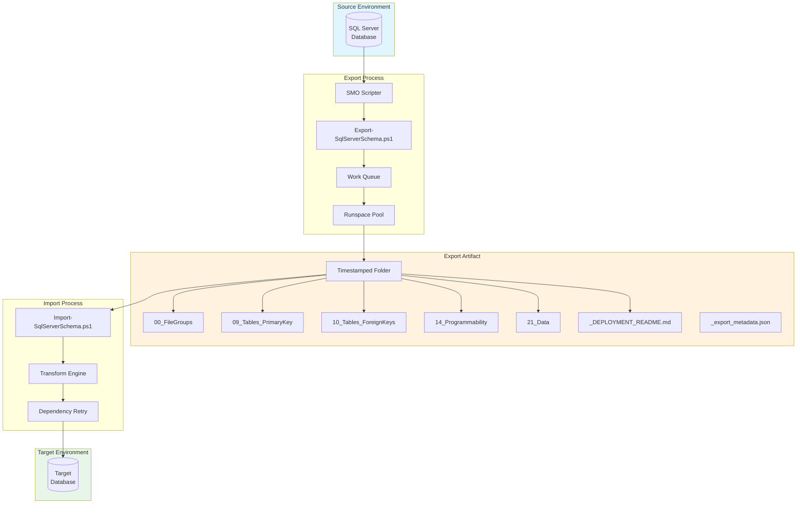

### 2.2 Dependency-Ordered Folder Structure

The 22-folder structure is the backbone of safe schema deployment. The numbering ensures lexicographic sorting matches dependency order:

```
Export Output/
├── 00_FileGroups/              # Physical storage (PRIMARY, secondary filegroups)
├── 01_Security/                # Principals: roles, users, certificates, keys
├── 02_DatabaseConfiguration/   # Scoped configs, credentials (secrets redacted)
├── 03_Schemas/                 # Namespace containers
├── 04_Sequences/               # Identity alternatives
├── 05_PartitionFunctions/      # Range/list boundaries
├── 06_PartitionSchemes/        # FileGroup mappings
├── 07_Types/                   # UDTs, table types, CLR types
├── 08_XmlSchemaCollections/    # XML validation schemas
├── 09_Tables_PrimaryKey/       # Tables with PKs, no FKs
├── 10_Tables_ForeignKeys/      # FK constraints only
├── 11_Indexes/                 # Non-clustered, filtered, XML indexes
├── 12_Defaults/                # Legacy bound defaults
├── 13_Rules/                   # Legacy bound rules
├── 14_Programmability/         # Functions, procs, views, triggers
├── 15_Synonyms/                # Cross-database/server aliases
├── 16_FullTextSearch/          # Catalogs, stoplists
├── 17_ExternalData/            # External sources, file formats (PolyBase)
├── 18_SearchPropertyLists/     # Semantic search config
├── 19_PlanGuides/              # Query plan hints
├── 20_SecurityPolicies/        # Row-Level Security (RLS)
├── 21_Data/                    # INSERT statements (optional)
├── _DEPLOYMENT_README.md       # Human-readable deployment checklist
└── _export_metadata.json       # Export metadata (timestamps, object inventory)
```

### 2.3 Critical Dependency Decisions

| Decision | Rationale |
|----------|-----------|
| **Tables before FKs** | Circular FK references between tables would fail if FKs were inline |
| **Types before Tables** | User-defined types must exist before columns reference them |
| **Functions before Views** | Views may reference scalar functions in computed columns |
| **Security last** | RLS predicates reference functions/tables—must exist first |
| **Data last** | FK constraints must be disabled during bulk load |

---

## 3. Export Pipeline Architecture

### 3.1 Execution Phases

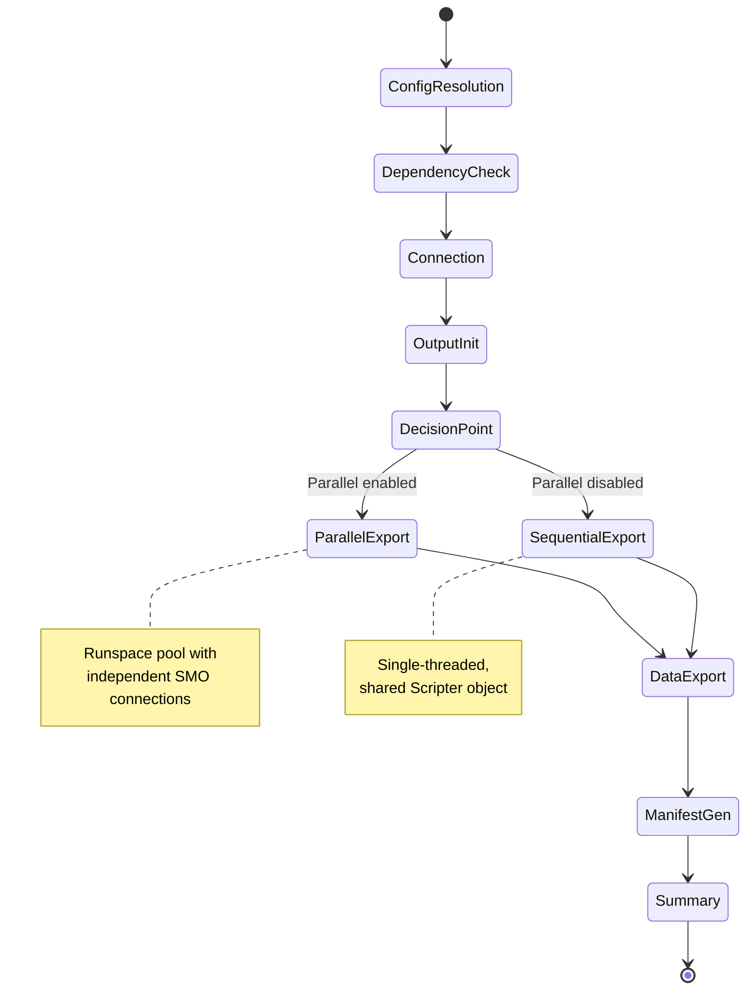

### 3.2 Configuration Resolution Order

Parameters are resolved with explicit precedence:

```
Priority (highest to lowest):
┌─────────────────────────────────────────────┐
│ 1. Command-line parameters                  │  ← Always wins
├─────────────────────────────────────────────┤
│ 2. YAML config file (export section)        │  ← Team defaults
├─────────────────────────────────────────────┤
│ 3. Script defaults                          │  ← Safe fallbacks
└─────────────────────────────────────────────┘
```

### 3.3 Object Filtering System

The export script implements a three-tier filtering model:

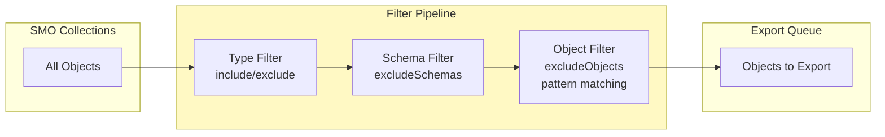

**Filter Functions:**

| Function | Purpose | Pattern Support |
|----------|---------|-----------------|
| `Test-ObjectTypeExcluded` | Whitelist/blacklist by type | N/A |
| `Test-SchemaExcluded` | Skip entire schemas | Exact match |
| `Test-ObjectExcluded` | Skip specific objects | Wildcards (`staging.*`, `*.TempTable`) |

### 3.4 SMO Scripter Configuration

The `New-ScriptingOptions` function creates a baseline configuration, then object-specific overrides are applied:

```powershell
# Baseline (safe defaults)
ScriptingOptions {
    ToFileOnly         = $true
    AppendToFile       = varies by grouping mode
    IncludeHeaders     = $true
    ScriptBatchTerminator = $true
    AnsiFile           = $true     # UTF-8 encoding
    TargetServerVersion = $TargetVersion
}

# Table-specific overrides
Tables: {
    DriPrimaryKey  = $true   # Include PKs
    DriForeignKeys = $false  # Separate file
    Indexes        = $false  # Separate file
    Triggers       = $false  # Separate file
}

# FK-specific overrides
ForeignKeys: {
    DriForeignKeys = $true
    SchemaQualifyForeignKeysReferences = $true
}
```

### 3.5 Grouping Modes

The `groupByObjectTypes` configuration controls file granularity:

| Mode | Output Pattern | Use Case |
|------|----------------|----------|
| `single` | One file per object | Git-friendly diffs, individual deployments |
| `schema` | One file per schema | Moderate granularity, schema-based workflows |
| `all` | One file for all objects | Minimal files, faster bulk operations |

```
Example: Tables with different grouping modes

single mode:                    schema mode:                  all mode:
├── dbo.Orders.sql              ├── 001_dbo.sql               └── 001_AllTables.sql
├── dbo.OrderItems.sql          └── 002_Sales.sql
├── Sales.Customers.sql
└── Sales.Regions.sql
```

### 3.6 Export Metadata Generation

Every export generates `_export_metadata.json` containing a complete manifest of the export operation:

```json
{
  "version": "1.0",
  "exportStartTimeUtc": "2026-01-26T15:30:00.000Z",
  "exportStartTimeServer": "2026-01-26T10:30:00.000",
  "serverName": "localhost",
  "databaseName": "TestDb",
  "groupBy": "single",
  "includeData": false,
  "objectCount": 57,
  "objects": [
    { "type": "Table", "schema": "dbo", "name": "Customers", "filePath": "09_Tables_PrimaryKey/dbo.Customers.sql" }
  ],
  "fileGroups": [
    {
      "name": "FG_ARCHIVE",
      "files": [{
        "name": "TestDb_Archive",
        "originalSizeKB": 8192,
        "originalGrowthKB": 65536,
        "sizeVariable": "FG_ARCHIVE_SIZE",
        "growthVariable": "FG_ARCHIVE_GROWTH"
      }]
    }
  ]
}
```

**Metadata Purposes:**
- **Delta Export**: Provides baseline timestamp and object inventory for change detection
- **Import Reference**: FileGroup original values used as fallback when no config specified
- **Audit Trail**: Documents what was exported, when, and from where

---

## 4. Delta Export Architecture

Delta export enables efficient incremental exports by detecting and scripting only objects modified since a previous export. This dramatically reduces export time for large, stable databases.

### 4.1 Design Goals

| Goal | Implementation |
|------|----------------|
| **Minimize export time** | Script only changed objects; copy unchanged files |
| **Produce complete output** | Delta export folder is standalone and importable |
| **Detect all change types** | Modified, New, Deleted object tracking |
| **Maintain compatibility** | Output works with existing Import-SqlServerSchema.ps1 |

### 4.2 Change Detection Algorithm

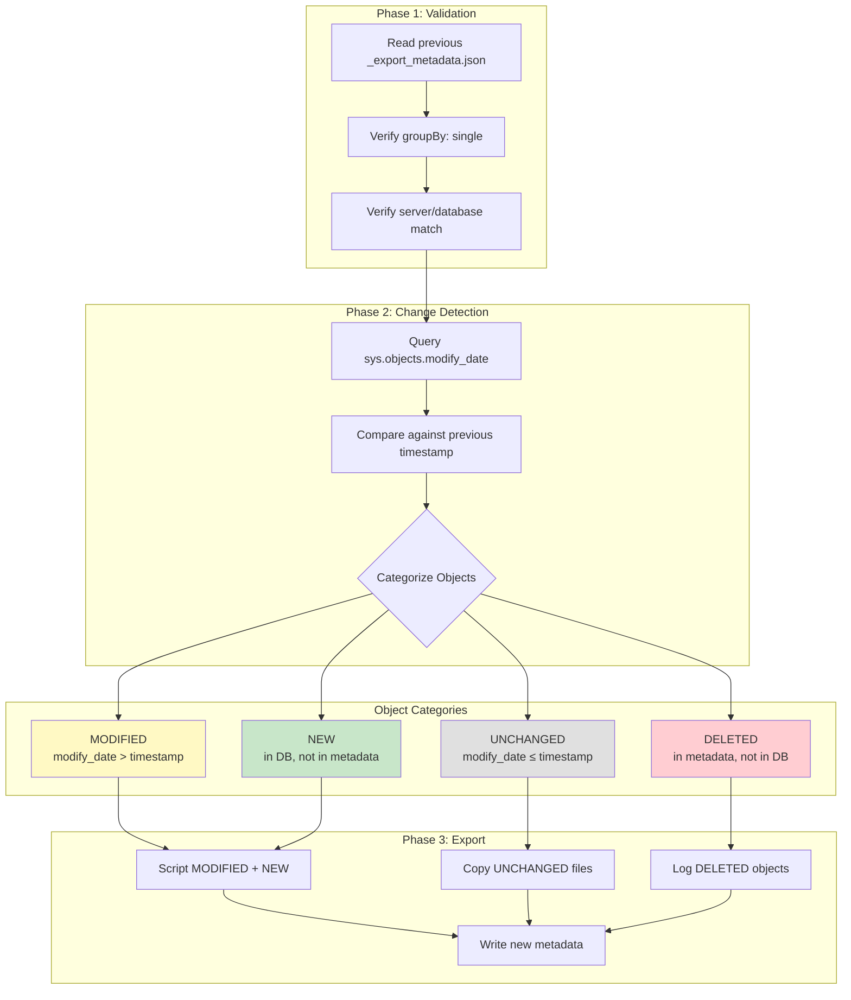

### 4.3 Objects Without modify_date

SQL Server's `sys.objects` does not track modification dates for all object types. These are **always exported** in delta mode:

| Object Type | Has modify_date | Delta Behavior |
|-------------|-----------------|----------------|
| Tables, Views, Procedures | Yes | Compare timestamps |
| Functions, Triggers, Synonyms | Yes | Compare timestamps |
| Sequences, Types | Yes | Compare timestamps |
| **Schemas** | No | Always export |
| **FileGroups** | No | Always export |
| **Partition Functions/Schemes** | No | Always export |
| **Security (Roles/Users)** | No | Always export |
| **Foreign Keys, Indexes** | No | Always export (safety) |
| **Database Configs** | No | Always export |

**Rationale**: For objects without reliable change tracking, the cost of always re-exporting is minimal compared to the risk of missing changes.

### 4.4 GroupBy Restriction

Delta export **requires `groupBy: single`** for all object types:

```
┌─────────────────────────────────────────────────────────────────────────────┐
│                     WHY SINGLE MODE IS REQUIRED                              │
├─────────────────────────────────────────────────────────────────────────────┤
│                                                                              │
│  groupBy: single                       groupBy: schema / all                 │
│  ───────────────                       ─────────────────────                 │
│  One file = One object                 One file = Multiple objects           │
│  ✓ Can copy unchanged files            ✗ Cannot copy partial files          │
│  ✓ Clear change attribution            ✗ Any change = re-export entire file │
│  ✓ Minimal delta overhead              ✗ No benefit over full export        │
│                                                                              │
└─────────────────────────────────────────────────────────────────────────────┘
```

### 4.5 Performance Characteristics

For a database with 2,400 objects where 50 changed since last export:

| Export Type | Objects Scripted | Files Copied | Typical Time |
|-------------|------------------|--------------|--------------|
| Full Export | 2,400 | 0 | ~90 seconds |
| Delta Export | 50 + always-export (~100) | 2,250 | ~15 seconds |

**Key Insight**: File copy operations are orders of magnitude faster than SMO scripting. Delta export leverages this by copying unchanged files directly from the previous export.

---

## 5. Import Pipeline Architecture

### 5.1 Execution Phases

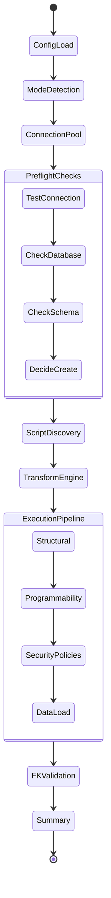

### 5.2 Import Modes

The import script supports two operational modes with distinct behaviors:

```
┌─────────────────────────────────────────────────────────────────────────────┐
│                            IMPORT MODE COMPARISON                            │
├─────────────────────────────────────────────────────────────────────────────┤
│                                                                              │
│  Developer Mode (Default)              Production Mode                       │
│  ─────────────────────────             ─────────────────                     │
│  • Skips FileGroups                    • Applies FileGroups with mappings    │
│  • Skips DB Configurations             • Applies DB Configurations           │
│  • Skips External Data Sources         • Applies External Data Sources       │
│  • RLS policies DISABLED               • RLS policies ENABLED                │
│  • Auto-remap file paths               • Explicit path mappings required     │
│                                                                              │
│  Purpose: Fast local iteration         Purpose: Controlled deployment        │
│                                                                              │
└─────────────────────────────────────────────────────────────────────────────┘
```

### 5.3 FileGroup Transformation Strategies

FileGroup handling is one of the most complex aspects of schema migration:

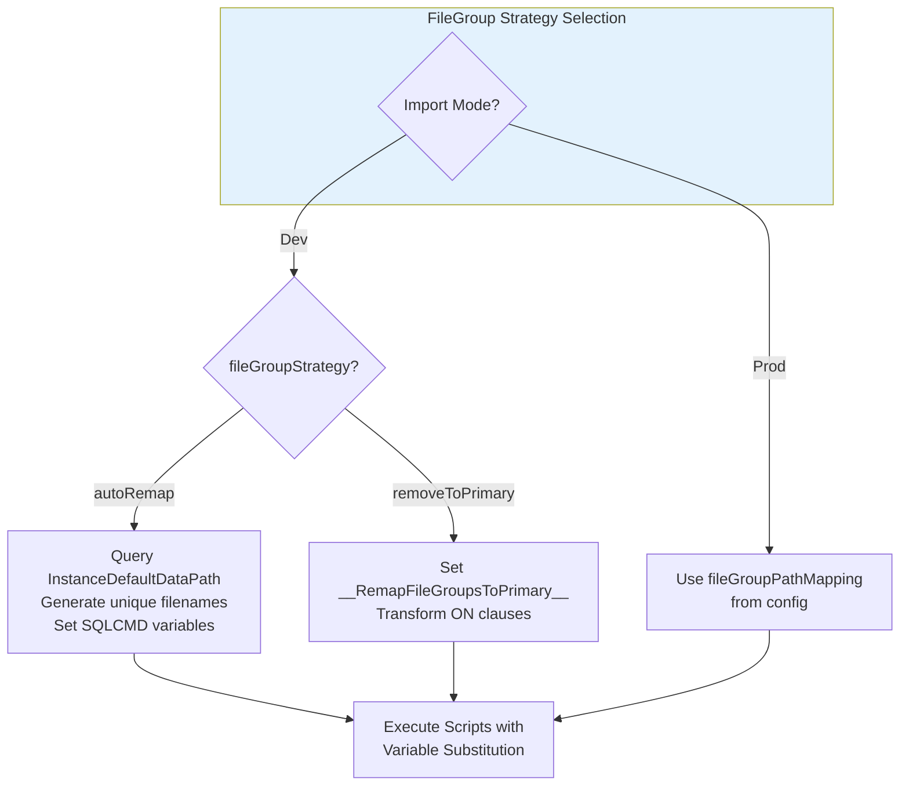

**Path Generation Logic (autoRemap):**

```
Input:  CREATE DATABASE ADD FILE (NAME = N'Data1', FILENAME = 'E:\Production\Data1.ndf')
                                                    ↓
        Query: SERVERPROPERTY('InstanceDefaultDataPath') → 'C:\SQLData\'
                                                    ↓
        Generate: $(FG_DATA_PATH_FILE) = 'C:\SQLData\TargetDb_FG_DATA_Data1.ndf'
                                                    ↓
Output: CREATE DATABASE ADD FILE (NAME = N'TargetDb_Data1', FILENAME = '$(FG_DATA_PATH_FILE)')
```

### 5.4 Script Transformation Pipeline

Every script passes through the transformation engine before execution:

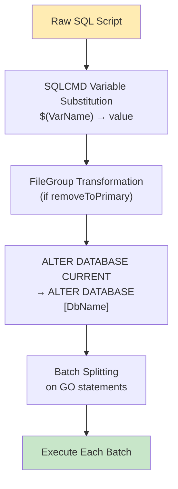

**Transformation Details:**

| Transform | Pattern | Replacement |
|-----------|---------|-------------|
| SQLCMD Variables | `$(VariableName)` | Configured value |
| FileGroup Remap | `ON [NonPrimary]` | `ON [PRIMARY]` |
| Partition Scheme | `TO ([FG1], [FG2])` | `ALL TO ([PRIMARY])` |
| Database Current | `ALTER DATABASE CURRENT` | `ALTER DATABASE [ActualName]` |
| Logical Names | `NAME = N'Original'` | `NAME = N'Database_Original'` |

### 5.5 Dependency Retry Algorithm

Programmability objects (functions, procedures, views) may have cross-dependencies that SMO scripting order cannot resolve. The import script uses a multi-pass retry strategy:

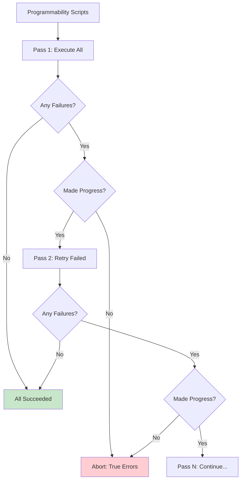

**Key Insight**: The algorithm stops when no progress is made in a pass. This prevents infinite loops on true syntax/permission errors while allowing legitimate dependency chains to resolve.

---

## 6. Concurrency Model

### 6.1 Parallel Export Architecture

The parallel export system uses PowerShell runspace pools with a producer-consumer pattern:

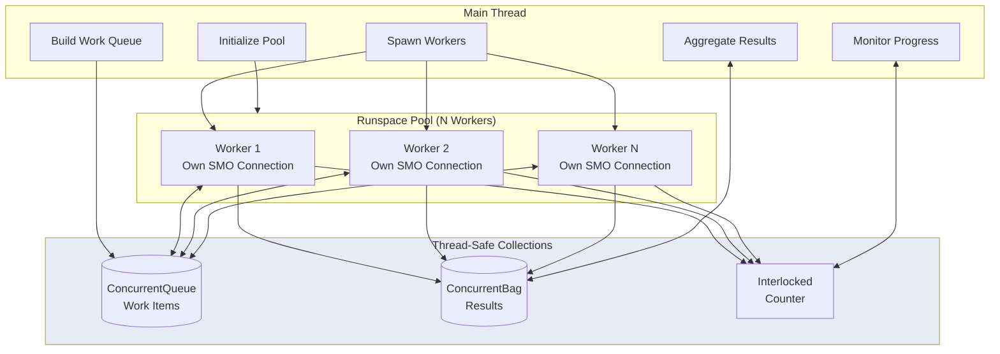

### 6.2 Work Item Design

Work items are **identifiers only**, not SMO objects:

```powershell
WorkItem = @{
    WorkItemId      = [guid]::NewGuid()
    ObjectType      = 'StoredProcedure'
    GroupingMode    = 'single'
    Objects         = @(
        @{ Schema = 'dbo'; Name = 'usp_ProcessOrders' }
    )
    OutputPath      = 'D:\Export\14_Programmability\dbo.usp_ProcessOrders.sql'
    ScriptingOptions = @{ ... }
    SpecialHandler  = $null  # or 'ForeignKeys', 'Indexes', etc.
}
```

**Why identifiers, not objects?**
- SMO objects hold COM interop handles that cannot cross thread boundaries
- Each worker creates its own SMO connection and resolves objects by name
- Eliminates serialization/deserialization overhead

### 6.3 Connection Isolation

Each parallel worker maintains complete connection isolation:

```
┌─────────────────────────────────────────────────────────────────────────────┐
│                         WORKER CONNECTION LIFECYCLE                          │
├─────────────────────────────────────────────────────────────────────────────┤
│                                                                              │
│  Worker Start                                                                │
│  ────────────                                                                │
│  1. Create ServerConnection with credentials from ConnectionInfo            │
│  2. Set TrustServerCertificate if configured                                │
│  3. Connect with timeout from config                                        │
│  4. Create Server object                                                    │
│  5. Get Database reference                                                  │
│  6. Create Scripter with PrefetchObjects = true                            │
│                                                                              │
│  Work Loop                                                                   │
│  ─────────                                                                   │
│  1. Dequeue work item (thread-safe ConcurrentQueue)                         │
│  2. Resolve SMO objects by identifier                                       │
│  3. Configure Scripter.Options for object type                             │
│  4. EnumScript to file                                                      │
│  5. Add result to ConcurrentBag                                            │
│  6. Increment Interlocked counter                                          │
│  7. Repeat until queue empty                                               │
│                                                                              │
│  Worker End                                                                  │
│  ──────────                                                                  │
│  1. Disconnect ServerConnection                                             │
│  2. Allow runspace to terminate                                            │
│                                                                              │
└─────────────────────────────────────────────────────────────────────────────┘
```

### 6.4 Hybrid Architecture (Unified Code Path)

Both sequential and parallel modes share the same work item generation and processing logic:

```
┌─────────────────────────────────────────────────────────────────────────────┐
│                        UNIFIED EXPORT ARCHITECTURE                           │
├─────────────────────────────────────────────────────────────────────────────┤
│                                                                              │
│  Build-ParallelWorkQueue                Process-ExportWorkItem               │
│  ──────────────────────                 ─────────────────────                │
│  • Single source of truth for          • Single implementation for          │
│    work item generation                   object scripting                  │
│  • Used by BOTH modes                   • Used by BOTH modes                │
│  • Handles all object types             • Handles special cases             │
│  • Respects grouping config             • (FKs, Indexes, Triggers)          │
│                                                                              │
│  Sequential Mode                        Parallel Mode                        │
│  ───────────────                        ─────────────                        │
│  • Processes work items in              • Distributes work items            │
│    main thread loop                       across runspace pool              │
│  • Uses same Process-ExportWorkItem     • Each worker calls same            │
│  • Progress grouped by ObjectType         Process-ExportWorkItem            │
│                                                                              │
│  RESULT: Identical output regardless of execution mode                      │
│                                                                              │
└─────────────────────────────────────────────────────────────────────────────┘
```

**TableData Filtering**: Work items of type `TableData` are filtered out before sequential processing since data exports are handled separately by `Export-TableData`. Parallel workers have explicit handlers for `TableData` work items.

**Benefits of Unified Architecture**:
- ~2,500 lines of duplicate code eliminated (28% reduction)
- Bug fixes automatically apply to both modes
- Consistent file naming and content across modes
- Easier maintenance and testing

---

## 7. Configuration System

### 7.1 Configuration Schema

The configuration uses YAML format with JSON Schema validation:

```yaml
# Connection settings (shared)
connectionTimeout: 30
commandTimeout: 300
maxRetries: 3
retryDelaySeconds: 2
trustServerCertificate: false  # SECURITY: Only true for dev

# Export settings
export:
  excludeObjectTypes:
    - Data
    - SecurityPolicies
  excludeSchemas:
    - staging
    - temp
  excludeObjects:
    - "dbo.LegacyTable"
    - "audit.*"
  groupByObjectTypes:
    Tables: single        # One file per table
    StoredProcedures: single
    Views: schema         # Group by schema
  parallel:
    enabled: true
    maxWorkers: 5
    progressInterval: 50

# Import settings
import:
  defaultMode: Dev
  developerMode:
    fileGroupStrategy: autoRemap
    includeFileGroups: false
    includeConfigurations: false
    enableSecurityPolicies: false
  productionMode:
    includeFileGroups: true
    fileGroupPathMapping:
      FG_CURRENT: "E:\\SQLData\\Current"
      FG_ARCHIVE: "F:\\SQLArchive"
    enableSecurityPolicies: true
  dependencyRetries:
    enabled: true
    maxRetries: 10
    objectTypes:
      - Functions
      - StoredProcedures
      - Views
```

### 7.2 Schema Validation

The configuration schema (`export-import-config.schema.json`) enforces:

- Valid object type names
- Enum constraints on grouping modes
- Integer ranges for timeouts and worker counts
- Required properties for production FileGroup mappings

---

## 8. Error Handling & Resilience

### 8.1 Retry Strategy

Both scripts implement `Invoke-WithRetry` with exponential backoff:

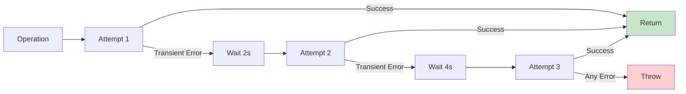

**Transient Error Detection:**

| Error Pattern | Classification |
|---------------|----------------|
| `timeout`, `timed out` | Network timeout |
| `40501`, `40613`, `49918` | Azure SQL throttling |
| `1205` | Deadlock victim |
| `connection.*lost` | Connection drop |
| `53`, `233`, `64` | Transport errors |

### 8.2 Error Logging

The `Write-ExportError` function captures full exception chains:

```
[ERROR] Failed to export StoredProcedure: dbo.usp_ComplexProc
  Target File: D:\Export\14_Programmability\dbo.usp_ComplexProc.sql
  Exception: Microsoft.SqlServer.Management.Smo.FailedOperationException
  Message: Script failed for StoredProcedure 'dbo.usp_ComplexProc'
    Inner Exception: System.InvalidOperationException
    Message: The object references an invalid column
      Inner Exception: SqlException
      Message: Invalid column name 'DeletedColumn'
        SQL Error 207, Line 15
```

### 8.3 Import Safety Checks

Before any write operations, the import script validates:

1. **Connection Test**: Can we reach the server?
2. **Database Existence**: Create if `-CreateDatabase`, else fail
3. **Schema Detection**: Existing objects require `-Force` flag
4. **Credential Handling**: Never persist, always PSCredential objects

---

## 9. Security Considerations

### 9.1 Credential Management

```
┌─────────────────────────────────────────────────────────────────────────────┐
│                          CREDENTIAL FLOW                                     │
├─────────────────────────────────────────────────────────────────────────────┤
│                                                                              │
│  User provides:                                                              │
│  $cred = Get-Credential                                                      │
│           ↓                                                                  │
│  PSCredential object (password in SecureString)                             │
│           ↓                                                                  │
│  ServerConnection.SecurePassword = $cred.Password                           │
│           ↓                                                                  │
│  NEVER logged, NEVER written to disk, NEVER echoed                          │
│                                                                              │
│  ──────────────────────────────────────────────────────────────────────     │
│                                                                              │
│  Database Scoped Credentials:                                                │
│  • Exported with placeholder: WITH SECRET = N'<REDACTED>'                   │
│  • NEVER imported automatically                                              │
│  • Requires manual creation on target                                       │
│                                                                              │
└─────────────────────────────────────────────────────────────────────────────┘
```

### 9.2 Input Sanitization

FileGroup and file names are sanitized before SQLCMD variable substitution:

```powershell
# Security: Only allow safe characters
if ($fgName -notmatch '^[a-zA-Z0-9_-]+$') {
    Write-Warning "FileGroup name '$fgName' contains unsafe characters. Skipping."
    continue
}
```

This prevents SQL injection via malicious FileGroup names like `FG'; DROP TABLE Users;--`.

### 9.3 Certificate Trust

The `trustServerCertificate` setting is deliberately conservative:

```yaml
# Default: false (fail if cert untrusted)
trustServerCertificate: false

# Only for isolated dev environments:
# WARNING: Disables server identity verification
# WARNING: Allows man-in-the-middle attacks
trustServerCertificate: true  # SECURITY RISK
```

---

## 10. Testing Strategy

### 10.1 Test Architecture

```
tests/
├── docker-compose.yml          # SQL Server 2022 container
├── test-schema.sql             # Complex schema fixture
├── create-perf-test-db-simplified.sql  # Performance test DB
├── run-integration-test.ps1    # Full export/import cycle
├── run-perf-test.ps1           # Performance benchmarks
├── test-parallel-export.ps1    # Parallel-specific tests
├── test-exclude-feature.ps1    # Filter validation
└── *.yml                       # Test configurations
```

### 10.2 Integration Test Workflow

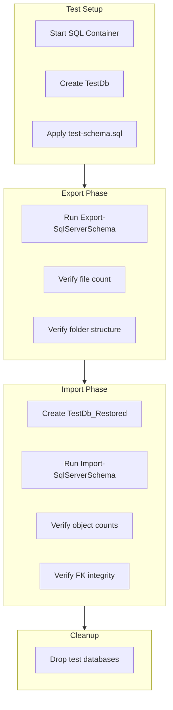

### 10.3 Test Coverage

| Category | Test Scenarios |
|----------|----------------|
| **Schema Objects** | All 22 object types, system object filtering |
| **Dependencies** | Circular FKs, view→function chains, RLS predicates |
| **Parallel Export** | Worker count variations, error recovery, progress tracking |
| **Import Modes** | Dev/Prod filtering, FileGroup strategies |
| **Transformations** | SQLCMD substitution, path rewriting |
| **Error Cases** | Missing permissions, syntax errors, connection failures |

---

## 11. Extension Points

### 11.1 Adding New Object Types

1. **Create builder function**: `Build-WorkItems-NewType` in export script
2. **Add to orchestrator list** in `Build-ParallelWorkQueue`
3. **Update folder structure** with appropriate number prefix
4. **Add filter support** in `Test-ObjectTypeExcluded`
5. **Update import folder discovery** in `Get-ScriptFiles`
6. **Add to config schema** for exclude/include options

### 11.2 Custom Transformations

Add new transforms in `Invoke-SqlScript`:

```powershell
# After existing transforms, before batch split:
if ($SqlCmdVariables.ContainsKey('__CustomTransform__')) {
    $sql = $sql -replace 'PATTERN', 'REPLACEMENT'
}
```

### 11.3 Alternative Output Formats

The current architecture supports alternative outputs by modifying the scripter pipeline:

```powershell
# Instead of file output:
$scripter.Options.ToFileOnly = $false
$scriptOutput = $scripter.EnumScript($objects)
# Then write to database, REST API, etc.
```

---

## Appendices

### A. Object Type Reference

| Object Type | SMO Collection | Has Schema | Folder |
|-------------|----------------|------------|--------|
| FileGroups | Database.FileGroups | No | 00 |
| Schemas | Database.Schemas | No | 03 |
| Sequences | Database.Sequences | Yes | 04 |
| Tables | Database.Tables | Yes | 09 |
| Views | Database.Views | Yes | 14 |
| StoredProcedures | Database.StoredProcedures | Yes | 14 |
| UserDefinedFunctions | Database.UserDefinedFunctions | Yes | 14 |
| DatabaseTriggers | Database.Triggers | No | 14 |
| SecurityPolicies | Database.SecurityPolicies | Yes | 20 |

### B. SQLCMD Variable Reference

| Variable Pattern | Purpose |
|-----------------|---------|
| `$(FG_NAME_PATH)` | Base path for FileGroup |
| `$(FG_NAME_PATH_FILE)` | Full path for first file |
| `$(FG_NAME_PATH_FILE2)` | Full path for second file || `$(FG_NAME_SIZE)` | Initial file size (e.g., `1024KB`) |
| `$(FG_NAME_GROWTH)` | File growth increment (e.g., `65536KB`) || `$(__RemapFileGroupsToPrimary__)` | Flag to enable PRIMARY remapping |

### C. Performance Characteristics

| Operation | Typical Time | Factors |
|-----------|--------------|---------|
| SMO Connection | 100-150ms | Network latency, auth method |
| Metadata Prefetch | 500ms-5s | Object count, complexity |
| Single Object Script | 5-50ms | Object size, options |
| Parallel Speedup | 2-4x | Worker count, I/O bound || Delta Export (unchanged) | <1ms/file | File copy vs. scripting || Import Transform | <1ms | Script size |
| Batch Execution | 10ms-10s | SQL complexity, data volume |

---

**Document Maintainers**: Database Engineering Team  
**Review Cycle**: Quarterly or with major feature changes
